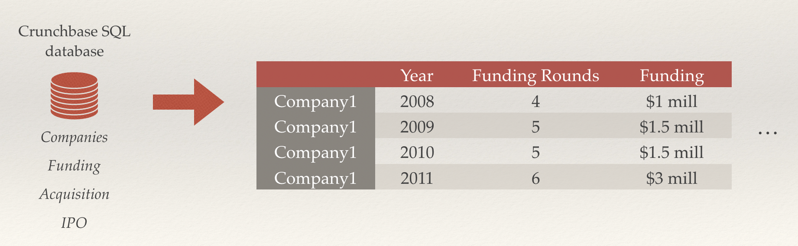
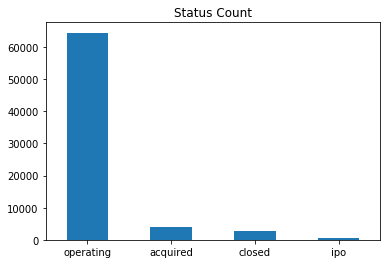
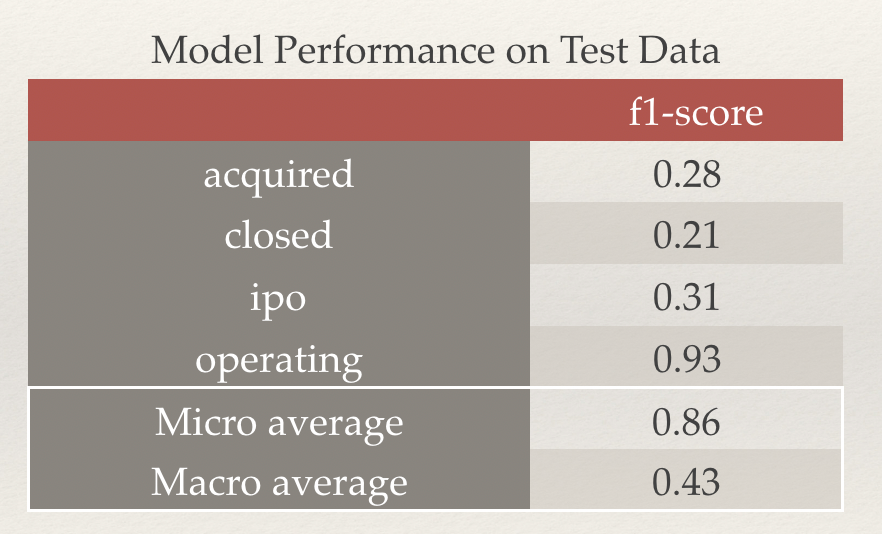

# Startup Billion Dollars or Bust? (Classification Project)

## Overview
As a potential investor or hire, how can you assess whether to further invest or join a startup? This project predicts type of status (acquisition, IPO, close, operating) for a company given current funding and company information.
This can help potential investors or employees to look out factors to assess a startup and the potential exit path.

## Data Source
[Crunchbase 2013 Snapshot © 2013](https://data.crunchbase.com/docs/2013-snapshot)

## Code at Github
Here is the github repo for this project: [link](https://github.com/pytgit/startup-classification)

## Methodology Used
1. From the [Crunchbase 2013 snapshot data](https://data.crunchbase.com/docs/2013-snapshot) site:
    * [MySql backup files](https://dev.mysql.com/doc/refman/8.0/en/mysqldump.html) are downloaded
    * Backup files are restored as MySQL databases
    * MySQL database is migrated to local Postgres DB for further processing and analysis using [pgloader utility](https://pgloader.io/)
2. Wrangle data such that training data represent yearly snapshot of a company’s funding information:

  

[(code here)](https://github.com/pytgit/startup-classification/blob/master/Clean%20data%20and%20feature%20engineering.ipynb)

3. Predictor classes are highly imbalanced, and the data was resampled for better model fitting:

  

4. Different sampling methods were experimented with, including random undersampling, random oversampling. SMOTEENN was selected to in the end because it yielded best results.
4. Tried multiple classifiers: KNN, Logistic Regression, Gradient Boosting, Naive Bayes, Random Forest. Gradient Boosting yielded the best initial results, so further parameter tweaking was attempted.

## Features Used
| Feature (Yearly Snapshots)    | Type                   |
|-------------------------------|------------------------|
| Days active                   | Numerical              |
| Number of investors           | Numerical              |
| Total funding raised          | Numerical              |
| Number of funding rounds      | Numerical              |
| Category                      | Categorical            |
| Region                        | Categorical            |

## Results
* Gradient Boosting yielded the best F1-macro score of 0.43 on test data set

  

* Model heavily biased towards ‘operating’ status prediction. See confusion matrix below:

  

* See Jupyter notebook for steps to get to results.
[(code here)](https://github.com/pytgit/startup-classification/blob/master/Model%20training.ipynb)

## Conclusions
* Funding information have some but not strong predicting power for predicting close, IPO, or acquired statuses
* For future work, explore having more heavy weights on predicting “closed” status correctly during training to help perspective employees and investors to especially avoid companies heading to closure
* Also, expanding data set size, and using data sources beyond Crunchbase with additional predictive features may help improve results:
    * e.g. company growth and performance data such as:
      * Revenue
      * Number of employees
